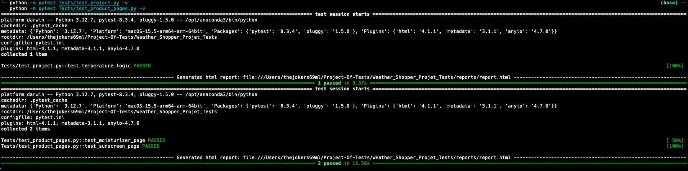
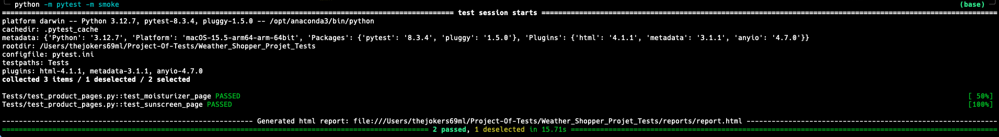
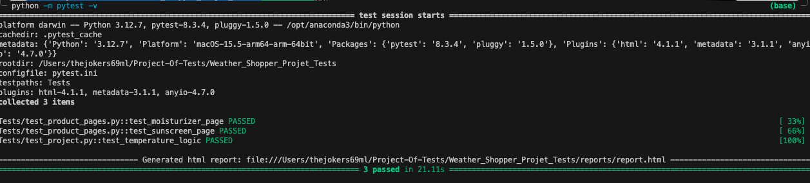
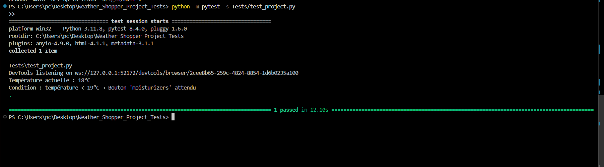
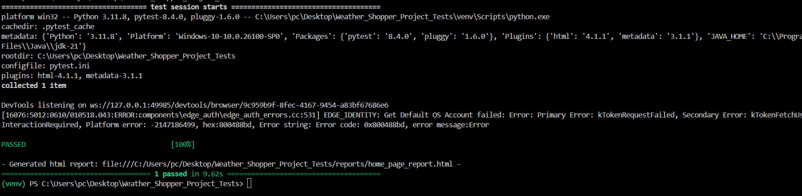
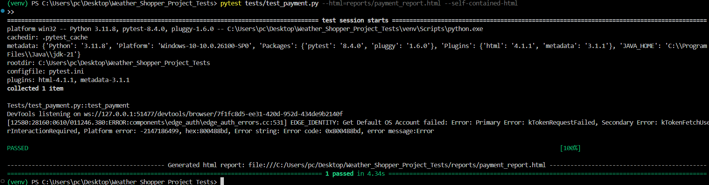

# Projet d'Automatisation des Tests Fonctionnels Web – Weather Shopper

## Contexte

Ce projet automatise le scénario principal (happy path) du site [Weather Shopper](https://weathershopper.pythonanywhere.com), une boutique en ligne qui propose des produits de soin selon la température ambiante.

---

## Objectif

Automatiser le parcours utilisateur suivant :

- Lire la température affichée sur la page d’accueil.
- Cliquer sur le bouton correspondant à la température :
  - **Moisturizers** si température < 19°C
  - **Sunscreens** si température > 34°C
  - Sinon, aucun bouton à cliquer.
- Vérifier que le bouton correct est visible selon la température.

---


## Structure du projet ``` 
```bash

Weather_Shopper_Project_Tests/
│
├── Pages/ # Page Object Model
│ ├── home_page.py
│ ├── moisturizers_product.py
│ ├── sunscreens_product.py
│ └── cart_page.py
│
├── Tests/ # Cas de test automatisés
│ ├── test_project.py # Logique de température
│ ├── test_product_pages.py # Tests produits
│ └── test_payment.py # Paiement Stripe
│
├── conftest.py # Configuration Pytest (driver setup)
├── requirements.txt # Dépendances
├── pytest.ini # Configuration Pytest
├── README.md # Documentation
└── reports/ # Rapports HTML pytest
 ```

---

## Prérequis

- **Python 3**
- **Selenium WebDriver**
- **Pytest**
- **Pytest-HTML** (pour les rapports de tests)
- **ChromeDriver**

---

## Installation

```bash
# Cloner le projet
git clone https://github.com/zinebfthdn/Weather_Shopper_Projet_Tests.git


cd Weather_Shopper_Project_Tests

# Créer un environnement virtuel (optionnel mais recommandé)
python -m venv venv
venv\Scripts\activate    # Sur Windows
# source venv/bin/activate   # Sur macOS/Linux

# Installer les dépendances
pip install -r requirements.txt

---

## Exécution des tests

### Commandes de test

Lancer un test spécifique :

```bash
python -m pytest Tests/test_project.py -v
python -m pytest Tests/test_product_pages.py -v
```



Lancer les tests avec génération de rapport HTML :

```bash
python -m pytest --html=reports/report.html --self-contained-html
```

Lancer uniquement les tests smoke :

```bash
python -m pytest -m smoke
```




Le navigateur Chrome s'ouvrira automatiquement grâce à webdriver-manager.

Les tests afficheront les résultats dans le terminal et un rapport HTML sera généré dans le dossier `reports/`.

La fenêtre du navigateur se fermera automatiquement à la fin des tests.

### Tests disponibles
Le projet contient maintenant plusieurs types de tests :

Lancer tous les tests : 

```bash
python -m pytest -v
```




1. **Test de logique de température** : `Tests/test_project.py`
   - Vérifie que le bon bouton apparaît selon la température



Aussi:



2. **Tests des pages produits** : `Tests/test_product_pages.py`
   - Test de la page moisturizers (sélection des produits Aloe et Almond les moins chers)
   - Test de la page sunscreens (sélection des produits SPF-30 et SPF-50 les moins chers)

   ```bash
   python -m pytest -m product
   ```

   

2. **Tests de page de payment** : `Tests/test_payment.py`
   - Simulation de paiement via Stripe avec carte test

   

## Les membres du projet

*Feth-Eddine Zineb*
*Aoun Houssam*
*Malek Jihane*
*Lakssir Mohamed*
